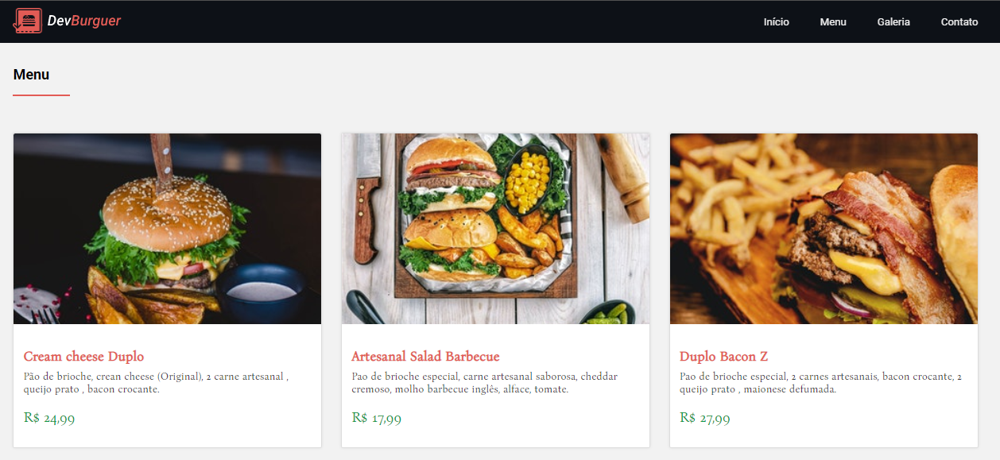

<p>


</p>

<p><a href="https://devburguer.netlify.app/">DevBurguer</a>, uma hambúrgueria fictícia, que oferece os melhores hambúrgueres de todo o universo. O site foi desenvolvido com <b>HTML5, CSS3 e Javascript</b>, utilizando recursos como <b>Flex-Box e CSS-Grid</b>. </p>



#### 💻 Executando

```sh
# Link: https://devburguer.netlify.app/

# Clone Repository
$ git clone git@github.com:EricNeves/devBurguer.git
# Install
$ cd devBurguer && npm install
# Execute
$ npm start
# Execute as dev
$ npm run dev
# Build
$ npm run build
```

#### 📝 License


